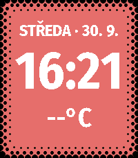

# Halftone

Open Halftone from the Pebble phone app and tap the gear icon to choose the
background and text colors. Both settings are stored on the watch and applied
immediately after saving. The dithered border remains black.

A Pebble Time 2 watchface that visually blends the screen into the physical
bezel using a procedural halftone-dot transition.

Halftone displays:

- configurable 12-hour or 24-hour time
- automatically localized day name and numeric date
- current temperature in Celsius or Fahrenheit
- a black-to-orange halftone transition drawn directly from the screen edge
- an adaptive Timeline Peek layout for upcoming events
- optional recessed-dot and floating-text optical effects



## Install the prebuilt watchface

Download [`dist/Halftone-1.1.0.pbw`](dist/Halftone-1.1.0.pbw) and open it with
the Pebble mobile app to install it. The complete Pebble Store upload kit is
available as [`dist/Halftone-1.1.0-store-release.zip`](dist/Halftone-1.1.0-store-release.zip).
You can also build the source yourself as described below.

## How it works

The watch-side C app draws the interface and updates the clock once per minute.
Every 30 minutes it asks PebbleKit JS on the connected phone for fresh weather.
The phone obtains a coarse location, requests the current temperature from
Open-Meteo, and sends the rounded value back with AppMessage. No weather API
key is required.

The last successful temperature is persisted on the watch, so temporary phone
or network disconnection does not blank the display.

The settings page can switch independently between 24-hour and 12-hour time,
and between Celsius and Fahrenheit. Weather is cached internally in Celsius,
so changing the displayed unit works immediately even while the phone is
offline.

The weekday automatically follows the PebbleOS language. Halftone includes
English, Czech, Slovak, German, French, Spanish, Italian, Portuguese, Dutch,
Polish, Danish, Swedish, Norwegian, Finnish, Hungarian, Romanian and Turkish;
other locales fall back to English. Long translated names automatically use a
slightly smaller date font while the time remains unchanged.

When Pebble Timeline Quick View appears at the bottom of the screen, Halftone
uses the watchface unobstructed-area API to move the lower dotted edge above
the event card. The date, time and temperature are simultaneously rearranged
and switched to compact font sizes, then restored when the event card leaves.
The compact layout keeps the date below the complete top dot transition so no
row is covered by text.

## Build

Install the current Pebble command-line tool and SDK:

```sh
uv tool install pebble-tool
pebble sdk install latest
```

Then build the project:

```sh
git clone https://github.com/xefensor/halftone-watchface.git
cd halftone-watchface
pebble build
```

Run it in the Pebble Time 2 emulator:

```sh
pebble install --emulator emery
```

To install on a real Pebble Time 2, enable **Dev Connect** for the watch in the
Pebble mobile app, then run:

```sh
pebble login
pebble install --cloudpebble
```

The phone must grant location access to the Pebble app for automatic local
weather.

## Appstore release

The `store/` directory contains the final description, release notes, privacy
disclosure, raw Emery screenshots and optional 720 x 320 marketing banner.
See `store/PUBLISHING.md` for the upload checklist.

## Customize the design

The main visual parameters are near the top of `src/c/halftone.c`:

```c
#define DOT_OUTER_CORNER_RADIUS 30
#define DOT_SPACING 10
#define CLASSIC_DOT_TRANSITION_STEPS 3
#define DEPTH_DOT_TRANSITION_STEPS 4
```

The phone settings page exposes the native Pebble 64-color palette for both
the background and all text. It also has independent toggles for the original
three-step border versus a **4-step dot transition**, and for an offset black
shadow that makes the text appear to float. **Extra-large edge-to-edge text**
enlarges every information line and dynamically picks the largest time font
that fits the current digits across the PT2 display. Orange and white remain
the defaults; all optional effects default to off.

## Project structure

```text
src/c/halftone.c      Watchface rendering, time, persistence and AppMessage
src/pkjs/index.js     Phone-side weather request and Clay initialization
src/pkjs/config.js    Pebble phone-app settings page definition
resources/fonts/      Custom date, time and temperature fonts
package.json          Pebble Time 2 target, permissions and message keys
```

## License

Halftone's source code and original artwork are available under the
[PolyForm Noncommercial License 1.0.0](LICENSE). You may use, modify and share
them for noncommercial purposes. Commercial use requires separate permission
from Xef. Redistributed copies and derivatives must retain the license and the
required attribution notice naming Xef as the original author.

Because commercial use is restricted, Halftone is source-available rather than
OSI-approved open-source software.

### Third-party font

The bundled Fira Sans Condensed Bold font is licensed under the SIL Open Font
License 1.1. Its license text is included at
`resources/fonts/OFL-FiraSans.txt`.

`FiraSansCondensed-Bold-Time.ttf` is a derived copy used only for the oversized
numeric clock. Its fallback box glyph is empty so Pebble's bitmap-font compiler
can generate the 80–108 px clock sizes; the visible digits are unchanged.
